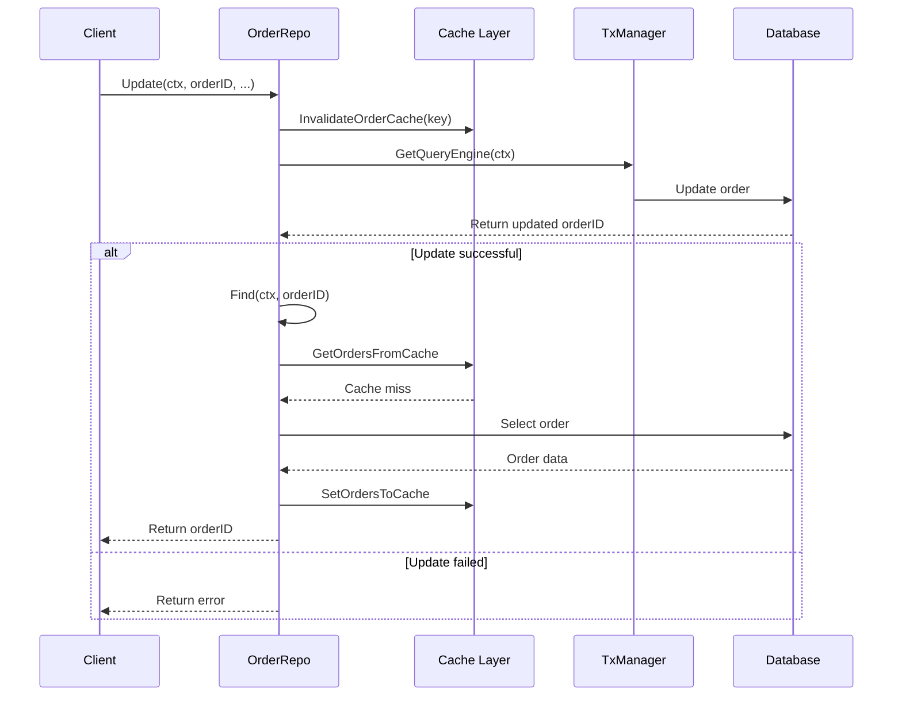

# Orders Management Application

## Environment Configuration

Data transformations between layers


1. Confirm Order
```bash
curl -X POST "http://localhost:9000/orders/" -u test:test -H "Content-Type: application/json" -d "{\"order_id\":123,\"user_id\":456,\"expiration_time\":\"2027-03-10T15:00:00Z\",\"status\":\"confirmed\",\"weight\":10,\"cost\":200,\"package_type\":\"box\",\"is_additional_film\":true}"
curl -X POST "http://localhost:9000/orders/" -u test:test -H "Content-Type: application/json" -d "{\"order_id\":999,\"user_id\":888,\"expiration_time\":\"2027-03-10T15:00:00Z\",\"status\":\"confirmed\",\"weight\":10,\"cost\":200,\"package_type\":\"box\",\"is_additional_film\":true}"
curl -X POST "http://localhost:9000/orders/" -u test:test -H "Content-Type: application/json" -d "{\"order_id\":34783,\"user_id\":888,\"expiration_time\":\"2027-03-10T15:00:00Z\",\"status\":\"confirmed\",\"weight\":10,\"cost\":200,\"package_type\":\"box\",\"is_additional_film\":true}"
curl -X POST "http://localhost:9000/orders/" -u test:test -H "Content-Type: application/json" -d "{\"order_id\":93435,\"user_id\":888,\"expiration_time\":\"2027-03-10T15:00:00Z\",\"status\":\"confirmed\",\"weight\":10,\"cost\":200,\"package_type\":\"box\",\"is_additional_film\":true}"
curl -X POST "http://localhost:9000/orders/" -u test:test -H "Content-Type: application/json" -d "{\"order_id\":97399,\"user_id\":888,\"expiration_time\":\"2027-03-10T15:00:00Z\",\"status\":\"confirmed\",\"weight\":10,\"cost\":200,\"package_type\":\"box\",\"is_additional_film\":true}"
curl -X POST "http://localhost:9000/orders/" -u test:test -H "Content-Type: application/json" -d "{\"order_id\":93499,\"user_id\":888,\"expiration_time\":\"2027-03-10T15:00:00Z\",\"status\":\"confirmed\",\"weight\":10,\"cost\":200,\"package_type\":\"box\",\"is_additional_film\":true}"
```
2. Confirm Orders (Batch)
```bash
curl -X POST "http://localhost:9000/orders/batch" -u test:test -F "file=@orders_to_load.json"
```
3. List Orders By User Id
```bash
curl -X GET "http://localhost:9000/orders/?user_id=456&last_id=0&limit=10" -u test:test
```
4. List All Orders
```bash
curl -X GET "http://localhost:9000/orders/" -u test:test
```
5. List Orders with Pagination
```bash
curl -X GET "http://localhost:9000/orders/?last_id=10&limit=20" -u test:test
```
6. List Refunded Orders
```bash
curl -X GET "http://localhost:9000/orders/?status=refunded&last_id=0&limit=10" -u test:test
```
7. Get Order By Id
```bash
curl -X GET "http://localhost:9000/orders/123?id=123" -u test:test
```
8. Return an Order
```bash
curl -X PUT "http://localhost:9000/orders/return/123" -u test:test
```
9. Process Order - Complete
```bash
curl -X PUT "http://localhost:9000/orders/complete/123/456" -u test:test
```
10. Process Order - Refund
```bash
curl -X PUT "http://localhost:9000/orders/refund/123/456" -u test:test
```
11. Search items
```bash
curl -v -u test:test http://localhost:9000/orders/?search=1
```

12. Run tests
```bash
go test ./tests/handlers_test -v -tags=integration
```

13. Run coverage
```bash
go test ./tests/handlers_test -v -tags=integration -cover
```